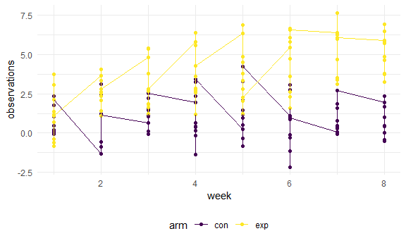

p8105\_hw5\_hq2182
================
Hanfei Qi
11/13/2020

## Problem 1

Read the data. Create a city\_state variable (e.g. “Baltimore, MD”).
Create a variable s.t. “Closed w/o arrest” & “No arrest” = “unsolved”,
while “Close by arrest” = “solved”

``` r
homicide_df = 
  read_csv("homicide_data/homicide-data.csv") %>% 
  mutate(
    city_state = str_c(city, state, sep = ", "),
    resolved = case_when(
      disposition == "Closed without arrest" ~ "unsolved",
      disposition == "Open/No arrest"        ~ "unsolved",
      disposition == "Closed by arrest"      ~ "solved",
    )
  ) %>% 
  select(city_state, resolved) %>% 
  filter(city_state != "Tulsa, AL")
```

Creat a new dataframe to store \#total cases and \#unsolved cases.

``` r
aggregate_df = 
  homicide_df %>% 
  group_by(city_state) %>% 
  summarize(
    hom_total = n(),
    hom_unsolved = sum(resolved == "unsolved")
  )
```

Run `prop.test` for “Baltimore, MD”; Apply `broom::tidy` to the result
and pull the estimated proportion and confidence intervals, then save
them in another dataframe.

``` r
Baltimore_prop = 
  prop.test(
  aggregate_df %>% filter(city_state == "Baltimore, MD") %>% pull(hom_unsolved),  
  aggregate_df %>% filter(city_state == "Baltimore, MD") %>% pull(hom_total)) %>% 
  broom::tidy() %>% 
  select(estimate, conf.low, conf.high)
```

Run `prop.test` for each city and extract estimated proportion and
confidence intervals.

``` r
results_df = 
  aggregate_df %>% 
  mutate(
    prop_tests = map2(.x = hom_unsolved, .y = hom_total, ~prop.test(x = .x, n = .y)),
    tidy_tests = map(.x = prop_tests, ~broom::tidy(.x))
  ) %>% 
  select(-prop_tests) %>% 
  unnest(tidy_tests) %>% 
  select(city_state, estimate, conf.low, conf.high)
```

Create a plot that shows the estimates and CIs for each city, add error
bars based on the upper and lower limits.

``` r
results_df %>% 
  mutate(city_state = fct_reorder(city_state, estimate)) %>% 
  ggplot(aes(x = city_state, y = estimate)) +
  geom_point() + 
  geom_errorbar(aes(ymin = conf.low, ymax = conf.high)) + 
  ylab("Unsolved Homicides Proportion") +
  xlab("City, State") +
  theme(axis.text.x = element_text(angle = 90, vjust = 0.5, hjust = 1))
```


# Problem 2

Read, clean, and tidy data.  
`arm` shows which group this row belongs to. “con” means control group
and “exp” means experimental group.  
`id` contains identical id for each participant. `week` is the number of
week of observation.  
`observations` is the measured value of interest.

``` r
data_df = 
  tibble(
    file_name = list.files("lda_data"),
  ) %>% 
  mutate(
    path = str_c("lda_data/", file_name),
    data = map(.x = path, ~read_csv(.x)),
    arm = str_extract(file_name, "[a-z]{1,3}"),
    id = extract_numeric(file_name)) %>% 
  select(id, arm, data) %>% 
  unnest(data) %>% 
  pivot_longer(week_1:week_8,
               names_to = "week",
               values_to = "observations") %>% 
  mutate(
    week = extract_numeric(week)
  )
```

Make a spaghetti plot showing observations on each subject over time,
and comment on differences between groups.

``` r
data_df %>% 
  group_by(id, arm) %>% 
  ggplot(aes(x = week, y = observations, color = arm)) +
  geom_point() + geom_line()  
```



Comment: It’s obvious that observation values of experimental group are
larger than observation values of control groups. There were overlapping
values between two groups at the beginning of experiment. However,
observations were distinct bewteen two groups at week 7 and 8 (the end
of experiment).

# Problem 3
