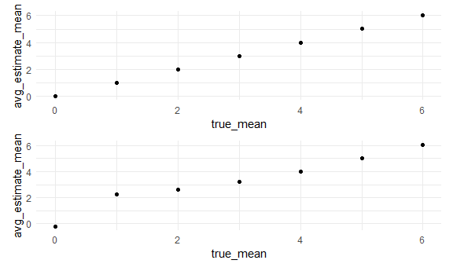

p8105\_hw5\_hq2182
================
Hanfei Qi
11/13/2020

## Problem 1

Read the data. Create a city\_state variable (e.g. “Baltimore, MD”).
Create a variable s.t. “Closed w/o arrest” & “No arrest” = “unsolved”,
while “Close by arrest” = “solved”

``` r
homicide_df = 
  read_csv("homicide_data/homicide-data.csv") %>% 
  mutate(
    city_state = str_c(city, state, sep = ", "),
    resolved = case_when(
      disposition == "Closed without arrest" ~ "unsolved",
      disposition == "Open/No arrest"        ~ "unsolved",
      disposition == "Closed by arrest"      ~ "solved",
    )
  ) %>% 
  select(city_state, resolved) %>% 
  filter(city_state != "Tulsa, AL")
```

Creat a new dataframe to store \#total cases and \#unsolved cases.

``` r
aggregate_df = 
  homicide_df %>% 
  group_by(city_state) %>% 
  summarize(
    hom_total = n(),
    hom_unsolved = sum(resolved == "unsolved")
  )
```

Run `prop.test` for “Baltimore, MD”; Apply `broom::tidy` to the result
and pull the estimated proportion and confidence intervals, then save
them in another dataframe.

``` r
Baltimore_prop = 
  prop.test(
  aggregate_df %>% filter(city_state == "Baltimore, MD") %>% pull(hom_unsolved),  
  aggregate_df %>% filter(city_state == "Baltimore, MD") %>% pull(hom_total)) %>% 
  broom::tidy() %>% 
  select(estimate, conf.low, conf.high)

Baltimore_prop
```

    ## # A tibble: 1 x 3
    ##   estimate conf.low conf.high
    ##      <dbl>    <dbl>     <dbl>
    ## 1    0.646    0.628     0.663

Run `prop.test` for each city and extract estimated proportion and
confidence intervals.

``` r
results_df = 
  aggregate_df %>% 
  mutate(
    prop_tests = map2(.x = hom_unsolved, .y = hom_total, ~prop.test(x = .x, n = .y)),
    tidy_tests = map(.x = prop_tests, ~broom::tidy(.x))
  ) %>% 
  select(-prop_tests) %>% 
  unnest(tidy_tests) %>% 
  select(city_state, estimate, conf.low, conf.high)

head(results_df)
```

    ## # A tibble: 6 x 4
    ##   city_state      estimate conf.low conf.high
    ##   <chr>              <dbl>    <dbl>     <dbl>
    ## 1 Albuquerque, NM    0.386    0.337     0.438
    ## 2 Atlanta, GA        0.383    0.353     0.415
    ## 3 Baltimore, MD      0.646    0.628     0.663
    ## 4 Baton Rouge, LA    0.462    0.414     0.511
    ## 5 Birmingham, AL     0.434    0.399     0.469
    ## 6 Boston, MA         0.505    0.465     0.545

Create a plot that shows the estimates and CIs for each city, add error
bars based on the upper and lower limits.

``` r
results_df %>% 
  mutate(city_state = fct_reorder(city_state, estimate)) %>% 
  ggplot(aes(x = city_state, y = estimate)) +
  geom_point() + 
  geom_errorbar(aes(ymin = conf.low, ymax = conf.high)) + 
  ylab("Unsolved Homicides Proportion") +
  xlab("City, State") +
  theme(axis.text.x = element_text(angle = 90, vjust = 0.5, hjust = 1))
```


# Problem 2

Read, clean, and tidy data.  
`arm` shows which group this row belongs to. “con” means control group
and “exp” means experimental group.  
`id` contains identical id for each participant. `week` is the number of
week of observation.  
`observations` is the measured value of interest.

``` r
data_df = 
  tibble(
    file_name = list.files("lda_data"),
  ) %>% 
  mutate(
    path = str_c("lda_data/", file_name),
    data = map(.x = path, ~read_csv(.x)),
    arm = str_extract(file_name, "[a-z]{1,3}"),
    id = readr::parse_number(file_name)) %>% 
  select(id, arm, data) %>% 
  unnest(data) %>% 
  pivot_longer(week_1:week_8,
               names_to = "week",
               values_to = "observations") %>% 
  mutate(
    week = readr::parse_number(week)
  )
```

``` r
head(data_df)
```

    ## # A tibble: 6 x 4
    ##      id arm    week observations
    ##   <dbl> <chr> <dbl>        <dbl>
    ## 1     1 con       1         0.2 
    ## 2     1 con       2        -1.31
    ## 3     1 con       3         0.66
    ## 4     1 con       4         1.96
    ## 5     1 con       5         0.23
    ## 6     1 con       6         1.09

Make a spaghetti plot showing observations on each subject over time,
and comment on differences between groups.

``` r
data_df %>% 
  group_by(id, arm) %>% 
  ggplot(aes(x = week, y = observations, color = arm)) +
  geom_point() + geom_line()  
```


Comment: It’s obvious that observation values of experimental group are
larger than observation values of control groups. There were overlapping
values between two groups at the beginning of experiment. However,
observations were distinct bewteen two groups at week 7 and 8 (the end
of experiment).

## Problem 3

Generate dataset, perform `t.test`, and extract estimate mean and
p-value. For the `t.test`, the null hypothesis is true mean equals to 0,
while alternative hypothesis is true mean is not equal to 0.  
The default setting is sample size = 30, mean = 0, and standard
deviation = 5.  
The estimate mean and p-value of test will be saved in a tibble.  
`sim_result` run 5000 times for each true\_mean from 0 to 6, then save
the result in a tibble.

``` r
sim_est_p = function(n = 30, mu = 0, sigma = 5) {
  sim_data = tibble(
    x = rnorm(n, mean = mu, sd = sigma))
  
  test = t.test(sim_data)
  
  tibble(
    estimate = test$estimate,
    p_value = test$p.value
  )
}

sim_result = 
  tibble(true_mean = c(0:6)) %>% 
  mutate(
    output_lists = map(.x = true_mean, ~rerun(5000, sim_est_p(mu = .x))),
    estimate_df = map(output_lists, bind_rows)
  ) %>% 
  select(-output_lists) %>% 
  unnest(estimate_df)
```

Make a plot showing the proportion of times the null was rejected (the
power of the test) on the y axis and the true value of μ on the x axis.
Given alpha = 0.05, so we reject the null when p\<0.05.

``` r
prop_plot = 
  sim_result %>% 
  filter(p_value < 0.05) %>% 
  group_by(true_mean) %>% 
  mutate(
    rejected = n(),
    power = rejected/5000
  ) %>% 
  ggplot(aes(x = true_mean, y = power)) +
  geom_point()

prop_plot
```


Comment: As the true mean increases from 0 to 6, the power of the test
increases (easier to reject the null). We almost reject the null for all
estimated mean from dataset with true mean = 5 and 6. The power is close
to 1.

Make a plot showing the average estimate of mean (μ\_hat) on the y axis
and the true value of μ on the x axis. Make a second plot the average
μ\_hat only in samples for which the null was rejected on the y axis
and the true value of μ on the x axis.

``` r
est_mu_plot = 
  sim_result %>% 
  group_by(true_mean) %>% 
  mutate(
    avg_estimate_mean = mean(estimate)
  ) %>% 
  ggplot(aes(x = true_mean, y = avg_estimate_mean)) +
  geom_point()

reject_plot = 
  sim_result %>% 
  filter(p_value < 0.05) %>% 
  group_by(true_mean) %>% 
  mutate(
    avg_estimate_mean = mean(estimate)
  ) %>% 
  ggplot(aes(x = true_mean, y = avg_estimate_mean)) +
  geom_point()

est_mu_plot / reject_plot
```



Comment:

  - For the first plot, the average μ\_hat is very close to the true
    mean because we have a large sample size.  
  - For the second plot, when the null is rejected, all average μ\_hat
    of those dataare far away from 0. When the true mean is close to 0,
    the μ\_hat has to be different from the true mean to reject the
    null. If the true mean \>= 3, we will reject the null for μ\_hat
    that closes to the true mean because it’s considered different from
    mu = 0 already.
